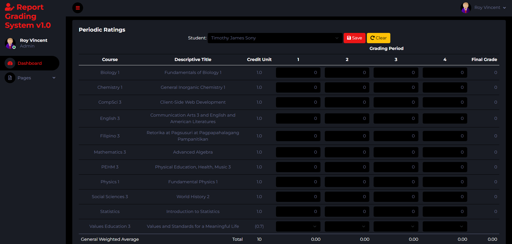

Project Update Plan
====================

## Title: Report Grading System v1.0

## Description Of The Website: 

Nowadays, data entry system for a specific tasks are highly regarded. In schools, teachers are finding ways to entered grades and automatically compute their general weighted average. One tool that is useful is Microsoft Excel but when the file is deleted or can't be found, the data is now lost. Once the teacher uses this website, the data is persisted in the server and can be updated from time to time. It is hosted in the cloud and can be access as long as internet connection is permitted.

To make the website functional and usable for intended users, the following steps will be followed:
* Conversion of HTML page into HBS page.
* Create links for each page in index.js.
* Process the screens based in their specified json file.

To be able to log in the system, you need the sample credentials below:
* Administrator (rvlcanseco@pshs.edu.ph / P@ssw0rd1234)
* Student (b2028tjbsony@pshs.edu.ph / P@ssw0rd1234)

When the adminstrator creates a data entry for student, the default password is **P@ssw0rd1234**.

## Description Of JSON Files:
```json
File: students.json
Purpose: To be used for logging in the site and storing the information for students.
Structure:
{
  "student_number": "text-string" 
  {
    "first_name": "text-string"",
    "middle_name": "text-string"",
    "last_name": "text-string"",
    "date_of_birth": "date",
    "email_address": "email-formatted-text-string",
    "is_student": "boolean",
    "profile_image": "text-link-to-the-uploaded-pic",
    "password": "text-string",
    "created_date": "date",
    "modified_date": "date"
  },
}
```
```json
File: subjects.json
Purpose: To be used for storing the information of subjects.
Structure:
{
  "subject_id":"text-string" 
  {
    "name": "text-string",
    "descriptive_title": "text-string",
    "credit_unit": "number",
    "is_included": "text-string",
    "created_date": "date",
    "modified_date": "date"
  },
}
```
```json
File: periodic-ratings.json
Purpose: To be used for storing the grades of each student for every quarter.
Structure:
{
  "student_number": "text-string"
  [
    {
      "subjects": [
        {
          "id": "text-string",
          "quarters": {
            "quarter1": "text-string",
            "quarter2": "text-string",
            "quarter3": "text-string",
            "quarter4": "text-string"
          }
        }
      ],
      "general_weighted_average": {
        "quarter1": "text-string",
        "quarter2": "text-string",
        "quarter3": "text-string",
        "quarter4": "text-string"
      }
    }
  ]
}
```

## Wireframes
1. **Login**
   
2. **Student**
   * Dashboard
   
   * Periodic Ratings List Screen
   
3. **Admin**
  - **Dashboard**    
  - **Students**
     - List 
     - Data Entry Screen 
  - **Subjects**
     - List 
     - Data Entry Screen 
  - **Periodic Ratings List & Data Entry Screen** 